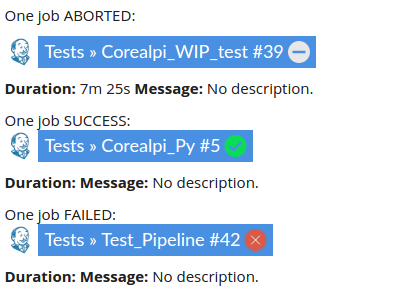

# Plugin Jenkins


Dokuwiki plugin for Jenkins user.

Features:
  * Display last build of a Job or a specific build
  * Display status of build
  * Display "weather" of the Job
  * Follow new Blue Ocean theme

In future versions, it will allow you to trigger a job from Dokuwiki.

# Requirements

This plugin does not require any prerequisites.

# Installation

Download Redissue plugin into your `${dokuwiki_root}/lib/plugins` folder and restart dokuwiki. Or use the plugin manager of Dokuwiki.

# Configuration

You should configure Dokwuki-Jenkins in the Config Manager of Dokuwiki:

* **jenkins.url**: Put your Jenkins url here, without a slash ending. i.e.: `http://my-jenkins.com`.
* **jenkins.user**: Set a Jenkins user with admin right if possible to display any job.
* **jenkins.token**: Set the corresponding Jenkins user token. You can find it in `http://JENKINS_URL/user/USER/configure`, then click on `Show API Token`" button.

# Syntax

To use Dokuwiki-Jenkins, use the below syntax:

```php
<jenkins job="JOB_NAME" />
```

If you job is in a folder, please use it as follow:

```php
<jenkins job="FOLDER/JOB_NAME" />
```

By default, jenkins plugin display the last build of your job. If you want to display a specific build, you can by adding the build option:

```php
<jenkins job="FOLDER/JOB_NAME" build="459"/>
```

# Preview



For further information, see also [Dokuwiki-Jenkins on dokuwiki.org](https://www.dokuwiki.org/plugin:jenkins)
